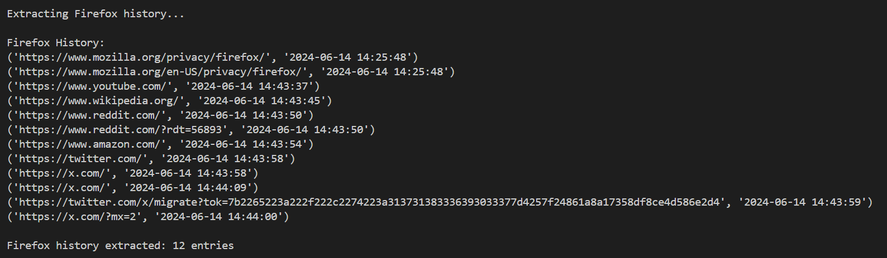
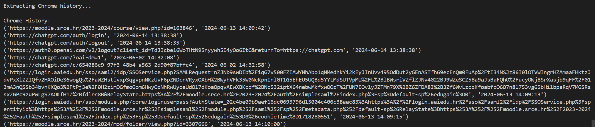
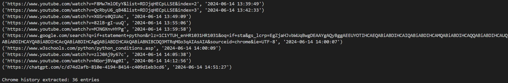
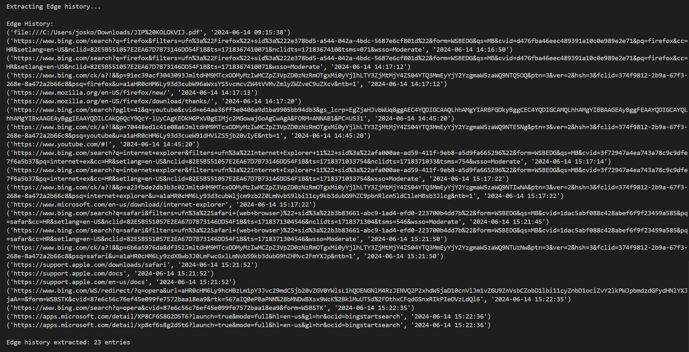
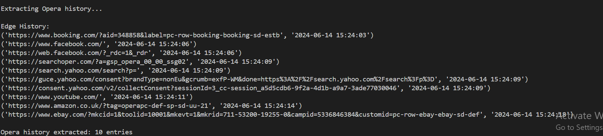

# Forenzika web preglednika

## 1. UVOD

Web preglednik je ključan softver za obavljanje raznih aktivnosti na internetu, poput slanja e-pošte, financijskih transakcija, preuzimanja datoteka i videozapisa, korištenja društvenih mreža te pregledavanja interneta. Budući da su web preglednici osnovno sredstvo za pristup internetu, cyber kriminalci ih često koriste za izvršavanje internetskih zločina. Primarni cilj digitalne forenzike je prikupljanje dokaza s mjesta zločina. Kao grana računalne forenzike, digitalna forenzika uključuje analizu digitalnih uređaja kao što su pisači i mobiteli. Kako sve više kriminalnih i civilnih slučajeva ovisi o dokazima prikupljenim iz online aktivnosti korisnika, forenzika web preglednika postaje sve značajnija u računalnoj forenzici.


Cilj ovog seminara je napraviti python skriptu koja prikuplja što je bilo traženo u određenom vremenskom okviru. Pretraga će se izvršavati na web preglednicima Mozilla Firefox, Google Chrome, Microsoft Edge i Opera.

# 2. PYTHON SKRIPTA

## 2.1. main

```python
if __name__ == "__main__":
    start_time = "2024-06-01 00:00:00"
    end_time = "2024-06-13 23:59:59"
    extract_browsing_history(start_time, end_time)
```

U **main** funckiji se odredi vremenski interval unutar kojeg se gleda što se pretražilo u svakom web pregledniku, te se nakon toga pozove funkcija **extract_browsing_history.**

## 2.2. extract_browsing_history

```python
def extract_browsing_history(start_time_str, end_time_str):
    start_timestamp = to_timestamp(start_time_str)
    end_timestamp = to_timestamp(end_time_str)

    print("\nExtracting Firefox history...")
    firefox_history = extract_firefox_history(start_timestamp, end_timestamp)
    print(f"\nFirefox history extracted: {len(firefox_history)} entries")

    print("\nExtracting Chrome history...")
    chrome_history = extract_chrome_history(start_timestamp, end_timestamp)
    print(f"\nChrome history extracted: {len(chrome_history)} entries")

    print("\nExtracting Edge history...")
    edge_history = extract_edge_history(start_timestamp, end_timestamp)
    print(f"\nEdge history extracted: {len(edge_history)} entries")

    print("\nExtracting Opera history...")
    opera_history = extract_opera_history(start_timestamp, end_timestamp)
    print(f"\nOpera history extracted: {len(opera_history)} entries")
```

**extract_browsing_history** funkcija pretvara datum iz **main** funkcije u timestamp, što je broj sekundi od 1. siječnja 1970. godine (poznat kao Unix epoch). Nakon toga se pozivaju jedna za drugom funkcije za izvlačenje podataka iz pojedinih preglednika.

## 2.3. extract_firefox_history

```python
def extract_firefox_history(start_time, end_time):
    user_profile = os.getenv("USERPROFILE")
    firefox_path = os.path.join(user_profile, "AppData", "Roaming", "Mozilla", "Firefox", "Profiles")
    if not os.path.exists(firefox_path):
        print("Firefox is not installed.")
        return []

    profiles = os.listdir(firefox_path)
    history = []

    for profile in profiles:
        profile_path = os.path.join(firefox_path, profile, "places.sqlite")
        if os.path.exists(profile_path):
            conn = sqlite3.connect(profile_path)
            cursor = conn.cursor()
            cursor.execute("""
                SELECT url, visit_date/1000000 
                FROM moz_places 
                JOIN moz_historyvisits 
                ON moz_places.id = moz_historyvisits.place_id 
                WHERE visit_date/1000000 BETWEEN ? AND ?
            """, (start_time, end_time))
            history.extend(cursor.fetchall())
            conn.close()
    
    return print_firefox_history([(url, utc_to_local(datetime.datetime.utcfromtimestamp(ts)).strftime('%Y-%m-%d %H:%M:%S')) for url, ts in history])
```

**extract_firefox_history** funkcija prvo pronađe putanju do firefox-a u pregledniku datoteka i napravi provjeru je li preglednik postoji. Nakon toga prolazi kroz sve profile koji se nalaze na putanji firefox-a i pomoću SQL upita pronalazi iz baze podataka places.sqlite, koja ima podatke o povijesti pretraživanja, linkove stranica koje su bile pretraživane u određenom vremenskom intervalu. Nakon toga se pozivaju redom **utc_to_local** i **print_firefox_history** funkcije.

```python
def utc_to_local(utc_dt):
    local_tz = pytz.timezone('Europe/Zagreb')
    utc_dt = pytz.utc.localize(utc_dt)
    local_dt = utc_dt.astimezone(local_tz)
    return local_dt
```

**utc_to_local** funkcija brine o tome da se uračuna u kojoj vremenskoj zoni se odvija pretraživanje.

```python
def print_firefox_history(history):
    if len(history):
        print("\nFirefox History:")
        for item in history:
            print(item)

    return history
```

**print_firefox_history** funkcija ispisuje sve linkove koji su pronađeni.

Za ostale preglednike je princip isti, pronađe se putanja na kojoj se nalazi preglednik, te se onda umjesto nekoj bazi podataka, kao npr. “places.sqlite”, dođe do mape History i dobiju se linkove što se pretraživalo u određenom vremenskom intervalu.

## 2.4. extract_chrome_history

```python
def extract_chrome_history(start_time, end_time):
    user_profile = os.getenv("USERPROFILE")
    chrome_path = os.path.join(user_profile, "AppData", "Local", "Google", "Chrome", "User Data", "Default", "History")
    if not os.path.exists(chrome_path):
        print("Google Chrome is not installed or the path is incorrect.")
        return []

    temp_path = chrome_path + "_tmp"
    shutil.copy2(chrome_path, temp_path)
    conn = sqlite3.connect(temp_path)
    cursor = conn.cursor()

    cursor.execute("""
        SELECT url, (last_visit_time/1000000)-11644473600
        FROM urls
        WHERE (last_visit_time/1000000)-11644473600 BETWEEN ? AND ?
    """, (start_time, end_time))

    history = cursor.fetchall()
    conn.close()
    os.remove(temp_path)
    
    return print_chrome_history([(url, utc_to_local(datetime.datetime.utcfromtimestamp(ts)).strftime('%Y-%m-%d %H:%M:%S')) for url, ts in history])
```

```python
def print_chrome_history(history):
    if len(history):
        print("\nChrome History:")
        for item in history:
            print(item)

    return history
```

## 2.5. extract_edge_history

```python
def extract_edge_history(start_time, end_time):
    user_profile = os.getenv("USERPROFILE")
    edge_path = os.path.join(user_profile, "AppData", "Local", "Microsoft", "Edge", "User Data", "Default", "History")
    temp_path = edge_path + "_tmp"
    shutil.copy2(edge_path, temp_path)
    conn = sqlite3.connect(temp_path)
    cursor = conn.cursor()

    cursor.execute("""
        SELECT url, (last_visit_time/1000000)-11644473600
        FROM urls
        WHERE (last_visit_time/1000000)-11644473600 BETWEEN ? AND ?
    """, (start_time, end_time))

    history = cursor.fetchall()
    conn.close()
    os.remove(temp_path)
    
    return print_edge_history([(url, utc_to_local(datetime.datetime.utcfromtimestamp(ts)).strftime('%Y-%m-%d %H:%M:%S')) for url, ts in history])
```

```python
def print_edge_history(history):
    if len(history):
        print("\nEdge History:")
        for item in history:
            print(item)

    return history

```

## 2.6. extract_opera_history

```python
def extract_opera_history(start_time, end_time):
    user_profile = os.getenv("USERPROFILE")
    opera_path = os.path.join(user_profile, "AppData", "Roaming", "Opera Software", "Opera Stable", "History")
    if not os.path.exists(opera_path):
        print("Opera is not installed or the path is incorrect.")
        return []

    temp_path = opera_path + "_tmp"
    shutil.copy2(opera_path, temp_path)
    conn = sqlite3.connect(temp_path)
    cursor = conn.cursor()

    cursor.execute("""
        SELECT url, (last_visit_time/1000000)-11644473600
        FROM urls
        WHERE (last_visit_time/1000000)-11644473600 BETWEEN ? AND ?
    """, (start_time, end_time))

    history = cursor.fetchall()
    conn.close()
    os.remove(temp_path)
    
    return print_opera_history([(url, utc_to_local(datetime.datetime.utcfromtimestamp(ts)).strftime('%Y-%m-%d %H:%M:%S')) for url, ts in history])
```

```python
def print_opera_history(history):
    if len(history):
        print("\nEdge History:")
        for item in history:
            print(item)

    return history
```

# 3. OUTPUT

U ispisu su linkovi i datumi kada je nešto bilo pretraživano u određenom pregledniku, te na kraju koliko ukupno je bilo stranica pregledano.













